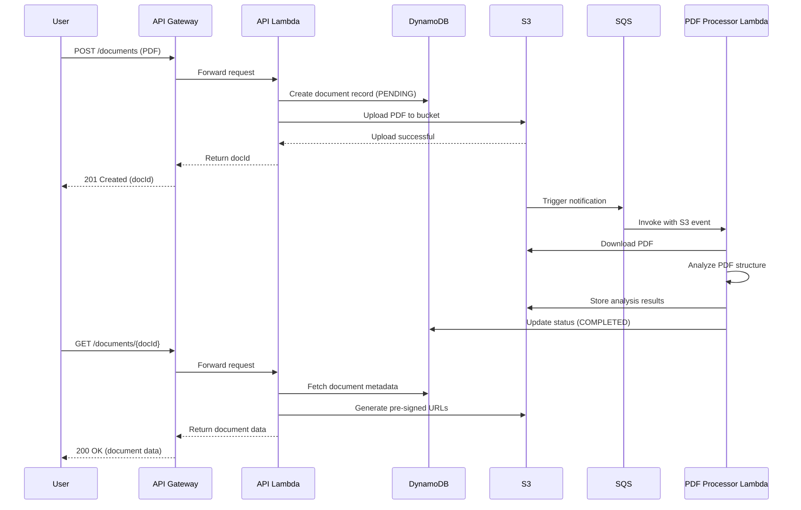

# PDF Structure Analysis Tool

## Motivation

The PDF Structure Analysis Tool is a serverless API designed to provide engineers with visual insights into PDF internals to help debug extraction errors. When working with PDF documents programmatically, understanding their internal structure is crucial for effective data extraction and processing. This tool enables:

- **Deep PDF inspection** - Visualize the layers and components that make up complex PDF documents
- **Extraction debugging** - Identify why certain content isn't being correctly extracted by seeing how it's actually represented in the PDF
- **Collaborative problem solving** - Share visual representations of document structure with team members

This project serves as a centralized showcase MVP that organizes our PDF analysis capabilities and makes it easy to share insights with stakeholders and team members.

## Project Structure

```
pdfa-api/
├── src/                        # Source code
│   ├── clients/                # AWS service clients (S3, DynamoDB)
│   ├── config/                 # Application configuration
│   ├── handlers/               # Lambda function handlers
│   ├── middleware/             # API middleware (auth, logging, error handling)
│   ├── models/                 # Data models
│   ├── pdf_processor/          # PDF analysis and processing logic
│   ├── repositories/           # Data access layer
│   ├── services/               # Business logic
│   └── utils/                  # Utility functions
├── tests/                      # Unit tests
├── docs/                       # Documentation
│   ├── api.yaml                # API specification
│   ├── tech-solution.md        # Technical solution documentation
│   ├── technical-assumptions.md # Technical assumptions
│   └── plan.md                 # Project plan
├── events/                     # Sample Lambda event payloads for testing
├── template.yaml               # AWS SAM template
├── samconfig.toml              # AWS SAM configuration
├── requirements.txt            # Python dependencies
└── requirements-dev.txt        # Development dependencies
```

## Key Features

- **PDF Layer Analysis**: Examine the different layers within PDF documents
- **Structure Visualization**: Generate visualizations of PDF structure elements
- **Object-level Metadata**: Extract and display metadata for PDF objects
- **Anomaly Detection**: Identify unusual patterns in PDF structure
- **Secure Document Handling**: All documents are encrypted and securely stored

## API Endpoints

| Endpoint                    | Method | Description                                      | Authentication |
|-----------------------------|--------|--------------------------------------------------|---------------|
| `/documents`                | POST   | Upload a PDF document for analysis               | JWT           |
| `/documents`                | GET    | List all uploaded documents                      | JWT           |
| `/documents/{docId}`        | GET    | Get analysis results for a specific document     | JWT           |
| `/documents/{docId}/pages/{page}` | GET | Get details for a specific page of a document | JWT           |
| `/version`                  | GET    | Get API version information                      | None          |

All authenticated endpoints require a valid JWT token, which is validated by the API Gateway JWT Authorizer.

## Technology Stack

- **Python 3.13**: Core programming language
- **AWS Lambda**: Serverless compute for API and processing tasks
- **AWS API Gateway**: REST API management
- **AWS DynamoDB**: NoSQL database for document metadata
- **AWS S3**: Storage for PDF documents and processed outputs
- **AWS SQS**: Message queue for triggering PDF processing
- **AWS SAM**: Infrastructure as Code and CI/CD

## Architecture Overview

The system uses a serverless architecture with the following components:

1. **API Gateway**: Provides HTTP endpoints for uploading, listing, and retrieving PDF documents
2. **Lambda Functions**:
   - API Handler: Manages HTTP requests/responses
   - PDF Processor: Triggered by SQS messages when new PDFs are uploaded
3. **SQS Queue**: Handles PDF processing tasks asynchronously
4. **DynamoDB**: Stores document metadata and processing status
5. **S3 Bucket**: Stores raw PDFs and processed analysis results

## Processing Flow



The flow consists of three main phases:

1. **Document Upload**: User submits a PDF document via the API, which is stored in S3 with metadata in DynamoDB.
2. **Asynchronous Processing**: An S3 event triggers the processing Lambda via SQS, which analyzes the PDF and stores results.
3. **Results Retrieval**: User requests analysis results, receiving document data with secure pre-signed URLs for accessing the processed assets.

## Security Features

- Private S3 buckets with SSE-S3 encryption
- JWT-based authentication
- Pre-signed URLs for secure asset delivery
- Least-privilege IAM roles

## Installation

### Prerequisites

- [AWS CLI](https://aws.amazon.com/cli/)
- [AWS SAM CLI](https://docs.aws.amazon.com/serverless-application-model/latest/developerguide/serverless-sam-cli-install.html)
- [Python 3.13](https://www.python.org/downloads/)
- [Docker](https://www.docker.com/products/docker-desktop)

### Local Development Setup

1. Clone the repository:
   ```bash
   git clone https://github.com/dimosaic/pdfa-api.git
   cd pdfa-api
   ```

2. Install dependencies:
   ```bash
   make install-dev
   ```

3. Run tests:
   ```bash
   make tests
   ```

4. Format code:
   ```bash
   make format
   ```

5. For local development with SAM:
   ```bash
   sam local start-api
   ```
   This will start the API Gateway locally, allowing you to test endpoints with tools like curl or Postman.

## Building and Deployment

### Build

To build the application:

```bash
make build
```

This validates the SAM template, prunes Docker images, and builds the application using containers.

### Deploy to Production

To deploy to production:

```bash
make deploy-prod
```

This deploys the application to AWS with production settings.

For a guided deployment with more control:

```bash
make deploy-prod-guided
```

### Configure AWS Resources

Set up ECR lifecycle policy:

```bash
make configure-ecr-policy
```

Configure S3 notifications (for PDF processing):

```bash
make configure-s3-notifications-prod
```

## Documentation

For more detailed information, refer to the following documentation:

- Technical Solution: [docs/tech-solution.md](docs/tech-solution.md)
- API Specification: [docs/api.yaml](docs/api.yaml)
- Technical Assumptions: [docs/technical-assumptions.md](docs/technical-assumptions.md)
- Project Plan: [docs/plan.md](docs/plan.md)

## Contributing

This project is optimised for a small team maintenance. We prioritize:
- Maintaining balance between simplicity and code quality
- Avoiding over-engineering solutions
- Optimizing for speed to market

When contributing, please follow the established code style and include appropriate tests.
